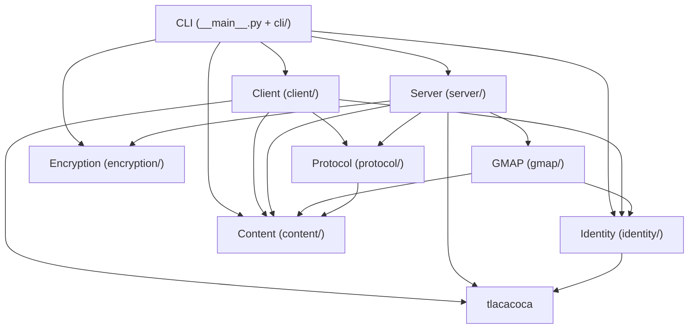

# Architecture

Titlani is organized in layers, from low-level wire format to high-level CLI.

## Layer Diagram

## Layers

### Protocol (`protocol/`)

The foundation. Defines the Misfin wire format:

- **`constants.py`** — Port, size limits, timeouts, wire format bytes
- **`status.py`** — `StatusCode` enum and utility functions
- **`request.py`** — `MisfinRequest` — parse and serialize request headers
- **`response.py`** — `MisfinResponse` — parse and serialize responses

This layer has no I/O and no dependencies beyond `content/` (for message parsing).

### Content (`content/`)

The gemmail message format:

- **`gemmail.py`** — `GemmailMessage` and `MisfinAddress` — structured message representation with serialization

Pure data layer, no I/O.

### Identity (`identity/`)

Misfin identity certificates:

- **`certificate.py`** — `MisfinIdentity`, `generate_identity_cert()`, `extract_identity()`, `normalize_fingerprint()`

Uses `cryptography` directly for certificate generation (not tlacacoca) because Misfin needs a custom certificate layout. Uses tlacacoca for fingerprint utilities.

### Encryption (`encryption/`)

At-rest encryption for stored messages:

- **`manager.py`** — `EncryptionManager` — X25519 ECDH + HKDF-SHA256 + AES-256-GCM encryption. Loads public keys for server-side encryption and private keys for CLI decryption.

Uses `cryptography` directly. No dependency on tlacacoca.

### Client (`client/`)

Async Misfin client:

- **`session.py`** — `MisfinClient` — high-level API with TOFU, redirects, context manager
- **`protocol.py`** — `MisfinClientProtocol` — low-level `asyncio.Protocol` implementation

### Server (`server/`)

Async Misfin server:

- **`config.py`** — `ServerConfig` — TOML configuration with validation
- **`handler.py`** — `MessageHandler` (abstract) and `FileMailboxHandler`
- **`protocol.py`** — `MisfinServerProtocol` — two-phase buffering state machine
- **`dispatcher.py`** — `ProtocolDispatcher` — multi-protocol multiplexer (available for external use)
- **`server.py`** — `start_server()` — server lifecycle with auto-cert, middleware, and separate GMAP port

### GMAP (`gmap/`)

Gemini Mailbox Access Protocol for remote mailbox retrieval:

- **`mailbox.py`** — `GmapMailbox` — per-mailbox JSON index (`.gmap.json`) with tag management and filesystem sync
- **`handler.py`** — `GmapHandler` — request routing and client certificate authentication, plus `GeminiRequest`/`GeminiResponse` types
- **`protocol.py`** — `GeminiServerProtocol` — single-phase `asyncio.Protocol` for Gemini requests

### CLI (`cli/` and `__main__.py`)

Typer-based CLI providing `send`, `serve`, `identity generate/info`, `tofu list/revoke`, `mail list/read/reply/delete`, and `version` commands.

- **`cli/display.py`** — Rich display helpers (tables, panels, formatting)
- **`cli/config.py`** — `ClientConfig` — client-side TOML config (XDG path via `platformdirs`)
- **`cli/mailbox.py`** — Shared mailbox resolution and message listing logic used by `mail list` and `mail read`
- **`__main__.py`** — Typer command definitions and CLI entry point

## Data Flow: Sending a Message

1. **CLI** parses arguments, loads identity certificate
2. **Client** creates TLS context, opens connection to recipient's host
3. **Client** builds `GemmailMessage` from body/subject/sender info
4. **Protocol** serializes message to wire format (`misfin://...` header + body)
5. **Client** sends bytes over TLS connection
6. **Client** reads response, parses status code
7. **Client** verifies server certificate against TOFU database
8. **Client** follows redirects if applicable (up to 5 hops)

## Data Flow: Receiving a Message

1. **Server** accepts TLS connection, extracts client certificate
2. **Server Protocol** buffers until CRLF (phase 1: header)
3. **Protocol** parses header into `MisfinRequest`
4. **Server Protocol** buffers until `content_length` bytes received (phase 2: body)
5. **Server** runs middleware chain (rate limiting, access control)
6. **Handler** validates hostname, checks mailbox exists
7. **Handler** parses gemmail message, encrypts if a public key is loaded for the mailbox
8. **Handler** stores as `.gemmail` (plaintext) or `.gemmail.enc` (encrypted) file
9. **Server** sends response with status code and fingerprint

## Data Flow: GMAP Remote Access

1. **Client** connects to the GMAP port (default 1960) with TLS client certificate
2. **GeminiServerProtocol** buffers until CRLF (single phase, no body)
3. **Gemini Protocol** parses Gemini URL into path, query, hostname
4. **Gemini Protocol** extracts client certificate from TLS transport
5. **Handler** authenticates: `extract_identity(cert)` extracts mailbox name
6. **Handler** verifies client cert fingerprint against registered identity
7. **Handler** loads `GmapMailbox` index, syncs with filesystem
8. **Handler** routes by path (`/msgid/`, `/tag/`, `/untag/`, `/delete`)
9. **Mailbox** performs the operation (list, tag, retrieve, delete)
10. **Handler** returns `GeminiResponse` with Gemini status code and body

## Design Decisions

**Why asyncio.Protocol instead of streams?**
The two-phase buffering model (header then body) maps naturally to `asyncio.Protocol`'s push-based `data_received` callback. This avoids the overhead of stream buffering for a protocol with small, bounded messages.

**Why separate identity certificate generation?**
Misfin identity certificates need USER_ID for the mailbox name, which isn't a standard certificate field. Tlacacoca's `generate_self_signed_cert()` doesn't support this, so `generate_identity_cert()` uses `cryptography` directly.

**Why a custom fingerprint format?**
Misfin(C) uses plain lowercase hex fingerprints, while tlacacoca uses the `sha256:hexdigest` format. The `normalize_fingerprint()` bridge function handles this at every boundary point.

**Why a separate port for GMAP?**
Misfin and GMAP have conflicting TLS requirements. Misfin must NOT request client certificates — senders present self-signed certs that would fail OpenSSL 3.x verification during the TLS handshake. GMAP must request client certificates for mailbox authentication. Since they can't share a TLS context, GMAP runs on its own port (default 1960). The GMAP specification explicitly allows any port.

**Why a JSON index for GMAP tags?**
GMAP requires per-message tags (Inbox, Unread, Trash, etc.), but the existing file-based mailbox storage has no metadata layer. A `.gmap.json` file per mailbox is simple, human-readable, and sufficient for typical mailbox sizes. For very large mailboxes (10k+ messages), a future migration to SQLite would be straightforward since the `GmapMailbox` API abstracts the storage.

**Why lazy filesystem sync?**
Messages delivered via Misfin are written directly as `.gemmail` files without updating the GMAP index. The GMAP handler syncs the index with the filesystem on each request, discovering new messages and removing deleted ones. This avoids tight coupling between the Misfin delivery path and the GMAP indexing layer — the Misfin handler doesn't need to know about GMAP at all.
